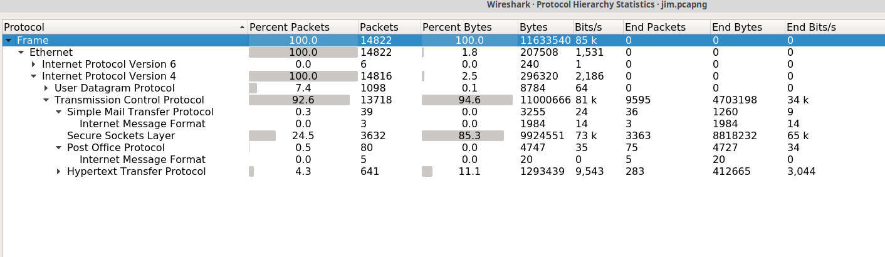
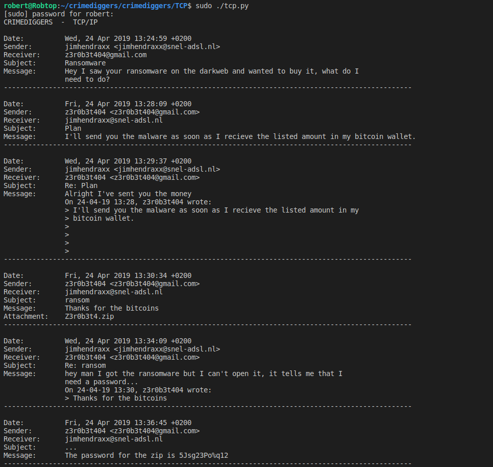
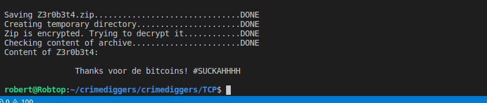

# TCP/IP

Om te beginnen laden we de capture in Wireshark en kijken we naar de protocol hierarchy

Wat we zien is dat er mail protocollen voorkomen in de capture: SMTP en POP, al dan niet gebruikmakend van IMF  
Om de capture te processsen is het python script `tcp.py` gemaakt. Dit script doet het volgende:  
* Leest de capture.  
* Parst alle packets die betrekking hebben op een van de voorkomende email protocollen.  
* Slaat alle benodigde infromatie op in een JSON structuur.  
* Print een timeline van alle emails die voorkomen in de capture.  
* Extract de attachments uit de capture en slaat deze lokaal op.  
* In het geval van zipfiles worden deze geopend.  
* In het geval van encrypte zipfiles wordt een poging gedaan deze te decrypten.  
* Waar mogelijk wordt de inhoud van de zips op het scherm getoond.  

Zie hieronder de output van het script:  
 
